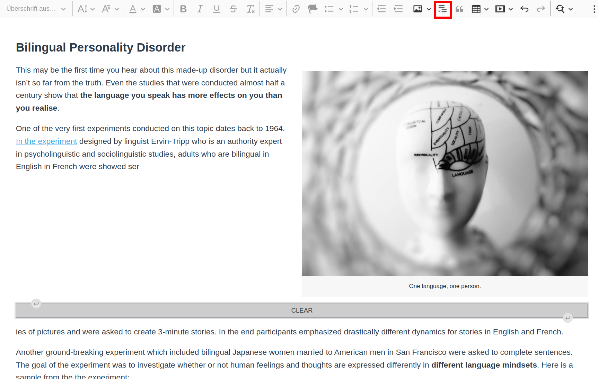

# CKEditor 5 Clear Float Plugin

Adds a Float clearing element and button to CKEditor 5.



## Installation

Add the following line as a devDependency to your
Install `ckeditor5-clear-float` as a dev dependency to your custom build.  
`npm i git+https://github.com/zendricom/ckeditor5-clear-float.git#main --save-dev`

## Usage

Import the plugin and add it to your plugin list, e.g.:
`import ClearFloat from "ckeditor5-clear-float/src/clearfloat";`

```
Editor.builtinPlugins = [
  ...
  ClearFloat,
  ...
];
```

Also add the button to your toolbar, e.g.:

```
Editor.defaultConfig = {
  toolbar: {
    items: [
       ...
      "clearFloat",
      ...
      ],
  },
}
```
